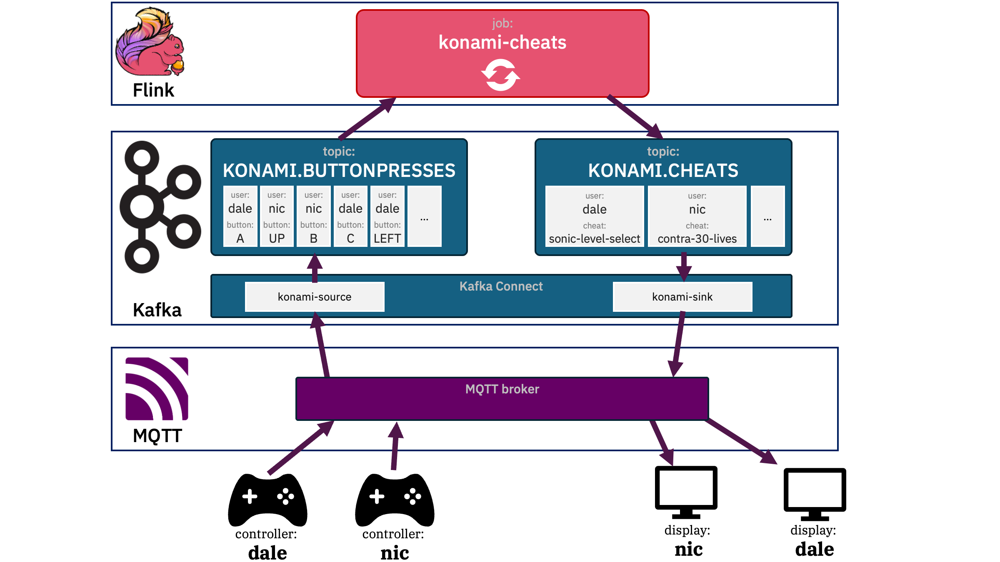

# Supporting files for the "Flink can recognize when you’re cheating" blog post

## Demo

<a href="https://youtu.be/pIA4lVWQqoY">screen recording of the demo</a>

## Setup

The <a href="https://dalelane.co.uk/blog/?p=5286">blog post</a> describes a simplified view of the demo - the full version is actually more like:

The use of MQTT was a convenience because we already had a way of getting the virtual controllers to publish/subscribe to MQTT brokers. Rather than add Kafka support to that, it was simpler to just bridge the gap using Kafka Connect.

## Contents:

- [Virtual controller used in the demo](./virtual-controller.sb3)
    - requires a <a href="https://hub.docker.com/r/dalelane/mlforkids-scratch">custom version of Scratch with MQTT support</a> to load this file
- [konami-source](./mqttsource.yaml)
    - Kafka Connect source connector with a <a href="./converters/">custom Single Message Transform</a> to turn MQTT string messages into JSON
- [Kafka topics](./topics.yaml)
    - Event Streams topic definition
- [Flink SQL job](./cheatcodes.sql)
- [konami-sink](./mqttsink.yaml)
    - Kafka Connect sink connector

